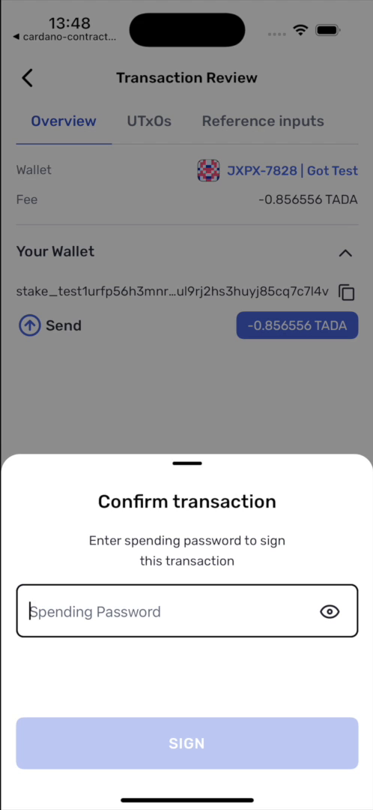

# Contract spend

`transfer/request/contract-spend` asks Yoroi to spend a UTxO sitting at a Plutus script
address and send the proceeds wherever you specify.

You describe the script input and the outputs. Yoroi builds the transaction — selecting
the user's own inputs, collateral and change, and computing the fee — then reviews it with
the user, signs, submits, and returns.

## Minimal request

```ts
import { linksYoroiModuleMaker } from '@yoroi/links';

const yoroiLinks = linksYoroiModuleMaker('yoroi');

const link = yoroiLinks.transfer.request.contractSpend({
  inputs: [
    {
      txHash: '0f1e…',              // the UTxO sitting at the script address
      outputIndex: 0,
      redeemer: {
        type: 'PlutusV3',
        data: 'd8799f02ff',          // your redeemer, CBOR hex
        exUnits: { mem: '7000000', steps: '3000000000' },
      },
      scriptReferenceTxHash: '0774…', // where the validator is published on chain
      scriptReferenceOutputIndex: 0,
      scriptHash: '115a…',
      scriptSize: 4313,
    },
  ],
  targets: [
    {
      receiver: 'addr_test1…',       // where the funds should end up
      amounts: [{ tokenId: '.', quantity: '4500000' }],
    },
  ],
  isTestnet: true,
  message: 'Withdraw from the savings contract',
  redirectTo: 'yourapp://',
});
```

## `inputs[]`

At least one entry. **Supply exactly one** — see
[Scope and limits](./07-scope-and-limits.md).

| Field | Type | Limit | Meaning |
|---|---|---|---|
| `txHash` | string | ≤256 | Transaction hash of the UTxO to spend |
| `outputIndex` | integer | ≥0 | Its index within that transaction |
| `redeemer.type` | `'PlutusV1' \| 'PlutusV2' \| 'PlutusV3'` | — | Use `PlutusV3` |
| `redeemer.data` | string | ≤16384 | The redeemer as CBOR hex |
| `redeemer.exUnits.mem` | string | ≤40 | Memory budget |
| `redeemer.exUnits.steps` | string | ≤40 | CPU step budget |
| `scriptReferenceTxHash` | string | ≤256 | Transaction holding the reference script |
| `scriptReferenceOutputIndex` | integer | ≥0 | Its output index |
| `scriptHash` | string | ≤128 | Hash of the validator |
| `scriptSize` | integer | ≥0 | Size of the reference script in bytes |

`exUnits` is optional in the schema, but omitting it means the request is priced with a
placeholder budget far below what any real script needs. Always supply it.

## `targets[]`

At least one entry. Where the proceeds go.

| Field | Type | Limit | Meaning |
|---|---|---|---|
| `receiver` | string | ≤256 | Destination address |
| `amounts` | array | 1–10 | What to send |
| `amounts[].tokenId` | string | ≤256 | `"."` for ADA, otherwise policy + asset name |
| `amounts[].quantity` | string | ≤80 | Lovelace for ADA |
| `datum` | string | ≤4096, optional | Inline datum on the output |

`receiver` is explicit and is not inferred from the signing wallet. If you want the funds
returned to the user, your app must already know the address to send them to.

## Execution units and script size

There is no script evaluation on the device, so `exUnits` and `scriptSize` are your inputs,
not the wallet's outputs, and they feed the fee directly:

```
fee = linear fee by transaction size
    + (exUnits.mem   × memory price)
    + (exUnits.steps × step price)
    + (scriptSize    × reference script price per byte)
```

Too low and the node rejects the transaction. Too high and the user overpays. Get the
numbers from your off-chain library's evaluator against the same script and datum, or from
a known-good run — do not guess. The example app uses fixed, deliberately generous values
because its script is fixed and its cost is known.

## What Yoroi does for you

<p align="center">
  
</p>

<p align="center"><sub>The review screen for a contract spend — note the <em>Reference inputs</em> tab, holding the script the request pointed at.</sub></p>


- Selects the user's own inputs to cover the fee
- Selects and sizes collateral
- Computes the fee and adds change
- Sets the script data hash and validity interval
- Presents a disclaimer and a review screen before anything is signed
- Submits the transaction and returns the hash

## What Yoroi does not do

- Evaluate your script
- Discover UTxOs at the script address — you name them
- Verify that your redeemer satisfies the validator
- Tell your app anything beyond the transaction hash

See the [spend-from-contract recipe](./recipes/spend-from-contract.md) for the request in
context, and [Security](./06-security.md) for what remains your responsibility.
