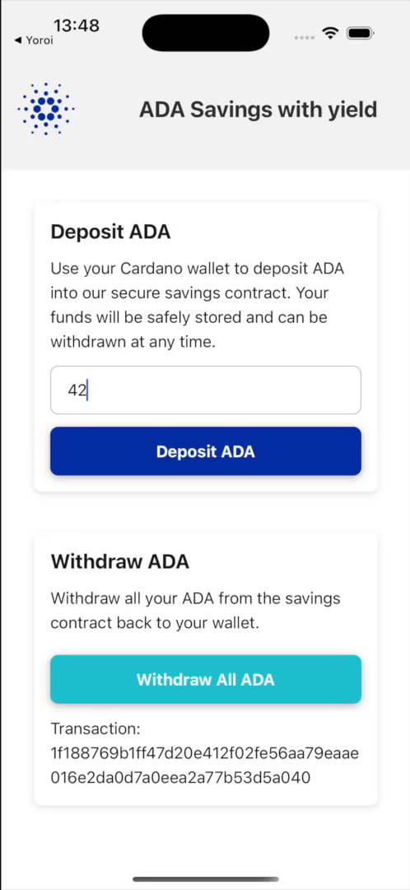

# Returning to your dApp

Set `redirectTo` and Yoroi will send the user back once the transaction is submitted.
Without it, the user is left on the wallet's transaction screen and never comes back.

## The response

Yoroi appends the transaction hash to your URL:

```
<redirectTo>?txid=<transaction hash>
```

That is the whole response. No signature, no witness, no address, no status field. If the
user cancels, nothing is appended and no return happens at all — your app simply never
hears back.

<p align="center">
  
</p>

<p align="center"><sub>Back in the dApp after signing, with the transaction hash read off the return URL.</sub></p>

## `redirectTo` must not contain a query string

The hash is appended by string concatenation with a literal `?txid=`. If your URL already
carries a query string you get two `?` and a URL that no parser reads correctly:

```
yourapp://?flow=deposit   →   yourapp://?flow=deposit?txid=abc123
                              txid: null
                              flow: "deposit?txid=abc123"
```

Keep the return URL bare:

```ts
redirectTo: 'yourapp://'
```

If you need to distinguish one request from another, put it in the **path**
(`yourapp://withdraw`) or track it in your app's own state before opening the link. The
example app does the latter — see `hooks/useYoroiReturnTx.ts`.

Two further constraints: `http://` return URLs are rejected outright, and the whole string
is limited to 2048 characters.

## Reading the return

```ts
import { useLinkingURL } from 'expo-linking';

const url = useLinkingURL();

const txid = url ? new URL(url).searchParams.get('txid') : null;
```

Treat the return like a cold start rather than a callback. Your app may have been evicted
while Yoroi was in the foreground, so any state you need afterwards must be persisted, not
held in memory.

Note also that the hash tells you a transaction was *submitted*, not that it succeeded.
Confirm it on chain before treating it as final.

## Platform configuration

Without these declarations `Linking.canOpenURL` returns `false` and nothing happens. They
are the most common reason an integration appears silently broken.

### iOS

`Info.plist` must list the schemes your app is allowed to ask about. In an Expo project,
`app.json`:

```json
{
  "expo": {
    "ios": {
      "infoPlist": {
        "LSApplicationQueriesSchemes": ["web+cardano", "yoroi"]
      }
    }
  }
}
```

### Android

Android 11 and later hide other applications unless you declare them. Add a `<queries>`
entry for the wallet's scheme and host:

```xml
<queries>
  <intent>
    <action android:name="android.intent.action.VIEW" />
    <data android:scheme="yoroi" android:host="yoroi-wallet.com" />
  </intent>
</queries>
```

In Expo, add it with a config plugin — see `examples/yoroi-demo/plugins/withAndroidQueries.js`.

### Your own scheme

Whatever you use for `redirectTo` must be registered by your app. In Expo that is
`expo.scheme` in `app.json`.
