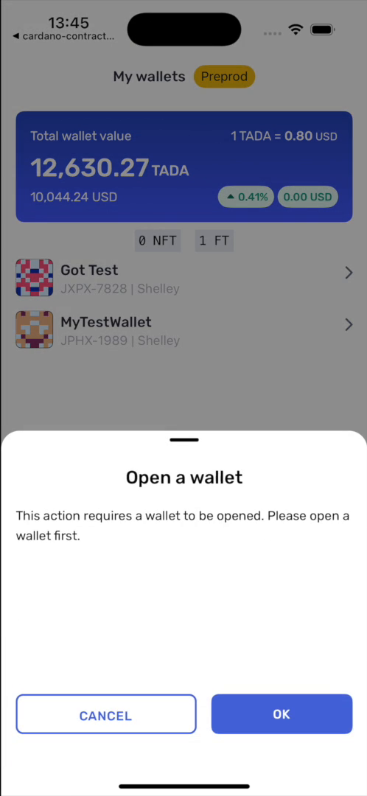

# Recipe · Lock funds into a contract

Deposit ADA at a script address with an inline datum attached. This is an ordinary transfer
request — the datum is what makes it a deposit rather than a payment.

```ts
import { linksYoroiModuleMaker } from '@yoroi/links';

const yoroiLinks = linksYoroiModuleMaker('yoroi');

export function buildDepositLink(lovelace: string): string {
  return yoroiLinks.transfer.request.ada({
    targets: [
      {
        receiver: SCRIPT_ADDRESS,   // addr_test1… — the contract
        datum: DATUM_HEX,           // inline datum, ≤1024 chars
        amounts: [{ tokenId: '.', quantity: lovelace }],
      },
    ],
    message: 'Deposit into the savings contract',
    redirectTo: 'yourapp://',
    isTestnet: true,
  });
}
```

**What the user sees.** Yoroi's transfer review screen, showing the destination and amount,
with your `message` as the explanation.

<p align="center">
  
</p>

<p align="center"><sub>The review screen for a deposit. The amount and destination come from your <code>targets</code>.</sub></p>

**What comes back.** `yourapp://?txid=<hash>` — the hash of the transaction that created
the script UTxO. Keep it: it is the input you will name when you later spend from the
contract.

**Notes.**

- `tokenId` is `"."` for ADA; `quantity` is lovelace, as a string.
- The datum must be inline. A datum hash will not work — see
  [Scope and limits](../07-scope-and-limits.md).
- Up to 5 targets per request, up to 10 amounts each.
- Confirm on chain before treating the deposit as final. The hash means submitted, not
  accepted.

Working code: `examples/yoroi-demo/lib/yoroiSavings.ts`, `buildDepositLink`.
