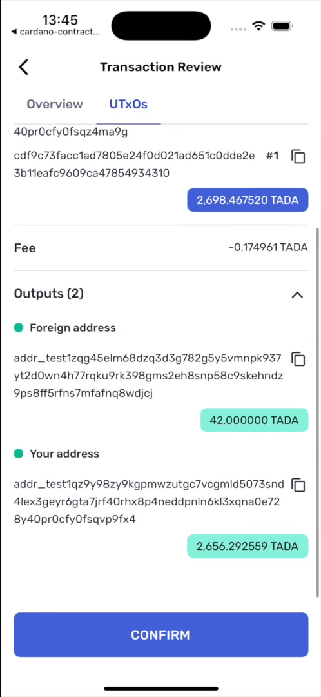

# Recipe · Request a simple ADA payment

No contract involved: ask the user to send ADA or native tokens somewhere.

```ts
import { linksYoroiModuleMaker } from '@yoroi/links';

const yoroiLinks = linksYoroiModuleMaker('yoroi');

const link = yoroiLinks.transfer.request.ada({
  targets: [
    {
      receiver: 'addr_test1…',
      amounts: [{ tokenId: '.', quantity: '2000000' }], // 2 ADA
    },
  ],
  memo: 'Invoice 1042',
  message: 'Pay invoice 1042 — 2 ADA',
  redirectTo: 'yourapp://',
  isTestnet: true,
});
```

**Sending a native token** — use the asset's id in place of `"."`:

```ts
amounts: [
  { tokenId: '.', quantity: '2000000' },
  { tokenId: '<policyId>.<assetNameHex>', quantity: '10' },
]
```

**Several recipients in one transaction** — up to 5 targets:

```ts
targets: [
  { receiver: 'addr_test1…a', amounts: [{ tokenId: '.', quantity: '2000000' }] },
  { receiver: 'addr_test1…b', amounts: [{ tokenId: '.', quantity: '3000000' }] },
]
```

**What comes back.** `yourapp://?txid=<hash>`.

<p align="center">
  
</p>

<p align="center"><sub>The confirmation step. Nothing is signed until the user enters their spending password.</sub></p>

**Notes.**

- `memo` is attached to the transaction; `message` is shown to the user in the wallet.
  They are different things and both are worth setting.
- Quantities are strings, in the smallest unit — lovelace for ADA.
