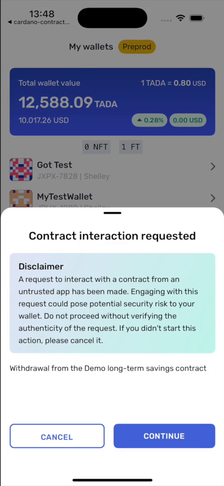

# Recipe · Spend from a contract

Unlock a UTxO sitting at a script address by supplying the redeemer the validator expects.

```ts
import { linksYoroiModuleMaker } from '@yoroi/links';

const yoroiLinks = linksYoroiModuleMaker('yoroi');

export function buildWithdrawLink(depositTxHash: string, lovelace: string): string {
  return yoroiLinks.transfer.request.contractSpend({
    inputs: [
      {
        txHash: depositTxHash,   // the UTxO created by the deposit
        outputIndex: 0,
        redeemer: {
          type: 'PlutusV3',
          data: REDEEMER_HEX,    // CBOR hex, e.g. 'd8799f02ff'
          exUnits: { mem: '7000000', steps: '3000000000' },
        },
        scriptReferenceTxHash: SCRIPT_REF_TX_HASH,
        scriptReferenceOutputIndex: SCRIPT_REF_INDEX,
        scriptHash: SCRIPT_HASH,
        scriptSize: SCRIPT_SIZE,
      },
    ],
    targets: [
      {
        receiver: USER_ADDRESS,  // explicit — not inferred from the wallet
        amounts: [{ tokenId: '.', quantity: lovelace }],
      },
    ],
    message: 'Withdraw from the savings contract',
    redirectTo: 'yourapp://',
    isTestnet: true,
    isSandbox: true,
  });
}
```

**What the user sees.** A disclaimer, then the contract-interaction review screen. The
disclaimer exists because a script interaction is harder to reason about than a payment.

<p align="center">
  
</p>

<p align="center"><sub>The disclaimer shown before any contract interaction. The line beneath it is your <code>message</code>.</sub></p>

**What comes back.** `yourapp://?txid=<hash>` for the spending transaction.

**Notes.**

- **One script input per request.** See [Scope and limits](../07-scope-and-limits.md).
- The validator must already be on chain as a **reference script** — that is what
  `scriptReferenceTxHash` and `scriptReferenceOutputIndex` point at.
- `exUnits` and `scriptSize` are yours to compute and feed the fee directly. See
  [Contract spend](../04-contract-spend.md#execution-units-and-script-size).
- `receiver` is explicit. The wallet does not send the proceeds to the signing account
  unless you name that address.
- Collateral comes from the user's own free ADA. A wallet whose funds are all locked cannot
  complete the request.

Working code: `examples/yoroi-demo/lib/yoroiSavings.ts`, `buildWithdrawLink`.
