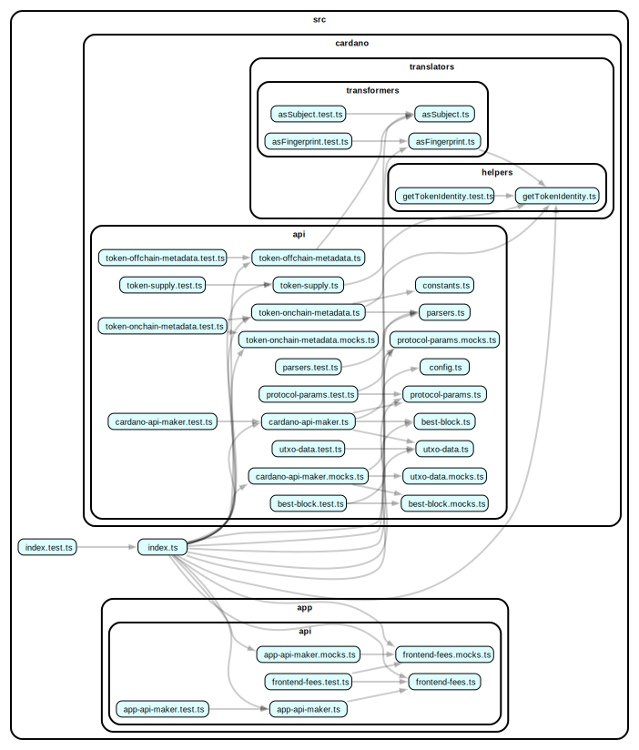

# @yoroi/api

[](https://www.npmjs.com/package/@yoroi/api)
[](https://opensource.org/licenses/Apache-2.0)
[](https://codecov.io/gh/Emurgo/yoroi)

A dedicated package for API interactions and data fetching for Yoroi clients.

## 📦 Installation

```bash
npm install @yoroi/api
# or
yarn add @yoroi/api
```

## 🔧 Requirements

- Node.js >= 22.12.0
- React >= 16.8.0 < 20.0.0
- React Native >= 0.79.0

## 🚀 Usage

The `@yoroi/api` package provides a comprehensive set of API utilities for interacting with Cardano blockchain data and application services.

### Cardano API

```tsx
import {CardanoApi} from '@yoroi/api'

// Get token metadata (on-chain)
const metadata = await CardanoApi.getOnChainMetadatas({
  tokenIds: ['your-token-id'],
  network: 'mainnet'
})

// Get off-chain token metadata
const offChainMetadata = await CardanoApi.getOffChainMetadata({
  tokenId: 'your-token-id',
  network: 'mainnet'
})

// Get token supply information
const supply = await CardanoApi.getTokenSupply({
  tokenId: 'your-token-id',
  network: 'mainnet'
})

// Get protocol parameters
const protocolParams = await CardanoApi.getProtocolParams({
  network: 'mainnet'
})

// Get UTXO data
const utxoData = await CardanoApi.getUtxoData({
  addresses: ['addr1...'],
  network: 'mainnet'
})

// Use the Cardano API maker for custom configurations
const customCardanoApi = CardanoApi.cardanoApiMaker({
  // Your custom configuration
})
```

### App API

```tsx
import {AppApi} from '@yoroi/api'

// Get frontend fees
const fees = await AppApi.getFrontendFees({
  network: 'mainnet'
})

// Use the App API maker for custom configurations
const customAppApi = AppApi.appApiMaker({
  // Your custom configuration
})
```

### Token Identity Utilities

```tsx
import {CardanoTokenId} from '@yoroi/api'

// Transform token ID to fingerprint
const fingerprint = CardanoTokenId.asFingerprint('your-token-id')

// Transform token ID to subject
const subject = CardanoTokenId.asSubject('your-token-id')

// Get token identity information
const identity = CardanoTokenId.getTokenIdentity('your-token-id')
```

### Metadata Parsers

```tsx
import {CardanoApi} from '@yoroi/api'

// Check if metadata is for an NFT
const isNft = CardanoApi.isNftMetadata(metadata)

// Check if metadata is for a fungible token
const isFt = CardanoApi.isFtMetadata(metadata)

// Check if metadata is a file
const isFile = CardanoApi.isMetadataFile(metadata)
```

## 📚 Documentation

For detailed documentation, please visit our [documentation site](https://github.com/Emurgo/yoroi/wiki).

## 🧪 Testing

```bash
# Run tests
npm test

# Run tests in watch mode
npm run test:watch
```

## 🏗️ Development

```bash
# Install dependencies
npm install

# Build the package
npm run build

# Build for development
npm run build:dev

# Build for release
npm run build:release
```

## 📊 Code Coverage

The package maintains a minimum code coverage threshold of 20% with a 1% threshold for status checks.

[](https://codecov.io/gh/Emurgo/yoroi)

## 📈 Dependency Graph

Below is a visualization of the package's internal dependencies:



## 🤝 Contributing

We welcome contributions! Please see our [Contributing Guide](https://github.com/Emurgo/yoroi/blob/develop/CONTRIBUTING.md) for more details.

## 📄 License

This project is licensed under the Apache License 2.0 - see the [LICENSE](https://github.com/Emurgo/yoroi/blob/develop/LICENSE) file for details.

## 🔗 Links

- [GitHub Repository](https://github.com/Emurgo/yoroi/tree/develop/packages/api)
- [Issue Tracker](https://github.com/Emurgo/yoroi/issues)
