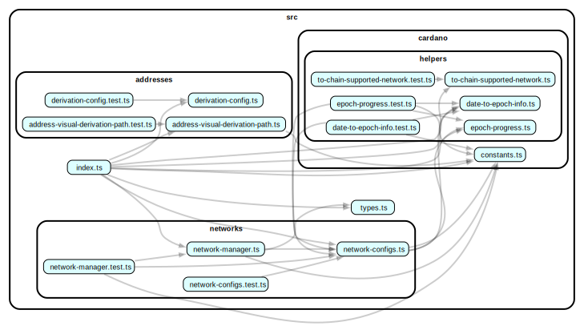

# @yoroi/blockchains

A dedicated package for blockchain logic for Yoroi clients.

## Overview

The `@yoroi/blockchains` package centralizes all blockchain-specific functionalities previously scattered throughout the Yoroi codebase.

## Project status

### Dependency graph

