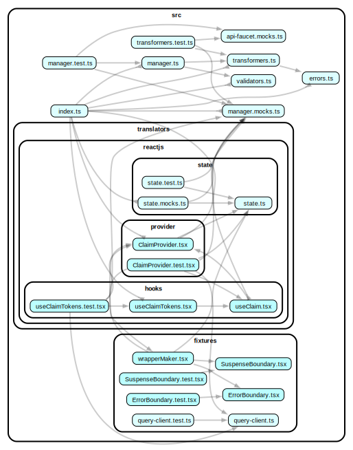

# @yoroi/claim

[](https://www.npmjs.com/package/@yoroi/claim)
[](https://opensource.org/licenses/Apache-2.0)
[](https://codecov.io/gh/Emurgo/yoroi)

## Overview

The `@yoroi/claim` is a utility package designed to handle token claims on the Cardano blockchain, following the CIP-99 (Cardano Improvement Proposal 99) standard for Proof of Ownership (POO) in decentralized token claiming. It provides an API for managing claim requests and responses, including error handling, token synchronization, and status management for claims.

The package works seamlessly with the Yoroi ecosystem and interacts with the Cardano blockchain to allow users to claim various tokens (both native and NFT) and manage their status in real-time.

## Features

Claim Token Handling: Process token claims for native assets, NFTs, and Lovelace based on claim responses.
Status Management: Handles multiple claim statuses such as `accepted`, `queued`, and `claimed`.
Error Handling: Provides detailed error messages and error handling based on claim API responses.
Token Synchronization: Synchronizes tokens with external sources to ensure the correct token information is used while displaying claims.
Support for [CIP-99](https://cips.cardano.org/cip/CIP-0099): Follows the Cardano Improvement Proposal 99 standard for Proof of Ownership (POO), enabling secure and decentralized token claims.

## Installation

To install the package, you can use npm or yarn:

```bash
npm install @yoroi/claim
```

or

```bash
yarn add @yoroi/claim
```

## Peer Dependencies

This package works alongside other `@yoroi` modules, such as `@yoroi/portfolio` and `@yoroi/types`. Ensure these dependencies are installed in your project:

```bash
npm install @yoroi/{portfolio,types}
```

## Usage

Creating a Claim Manager

The main utility of this package is the `claimManagerMaker` function. This function sets up a claim manager that can be used to request tokens to be claimed and sent to a specified Cardano address.

The `claimManagerMaker` requires the following inputs:

- `address`: The Cardano address where the claimed tokens should be sent.
- `primaryTokenInfo`: Information about the primary token (e.g., Lovelace) being claimed.
- `tokenManager`: A token manager responsible for handling the synchronization and management of token data, please check on `@yoroi/portfolio`
- `deps`: Optional dependency injection, providing a request function for interacting with the API.

```typescript
import {claimManagerMaker} from '@yoroi/claim'
import {tokenMocks} from '@yoroi/portfolio'
import {Portfolio} from '@yoroi/types'
import {fetchData} from '@yoroi/common'

import {tokenManager, primaryTokenInfo} from '../your-code'

const claimManagerOptions = {
  address: 'addr1q...xyz', // Address where the tokens should be sent
  primaryTokenInfo,
  tokenManager,
}

// Create a claim manager
const claimManager = claimManagerMaker(claimManagerOptions)

// Now you can use `claimManager.claimTokens()` to process a claim based on a Scan.ActionClain
const claimAction: Scan.ActionClaim = {
  action: 'claim',
  code: 'claim_code',
  params: {someParam: 'value'},
  url: 'https://api.example.com/claim',
}

claimManager.claimTokens(claimAction)
```

## Warning

This package will be interacting with an external API during the token claim process. Specifically, a scan action will trigger it and by providing the URL that will be hit during claim process. Be cautious when using this feature in production environments. Ensure that you are aware of the API's reliability, security, and any associated rate limits or costs.

## 📚 Documentation

For detailed documentation, please visit our [documentation site](https://github.com/Emurgo/yoroi/wiki).


## 🧪 Testing

```bash
# Run tests
npm test

# Run tests in watch mode
npm run test:watch
```

## 🏗️ Development

```bash
# Install dependencies
npm install

# Build the package
npm run build

# Build for development
npm run build:dev

# Build for release
npm run build:release
```

## 📊 Code Coverage

The package maintains a minimum code coverage threshold of 20% with a 1% threshold for status checks.

[](https://codecov.io/gh/Emurgo/yoroi)

## 📈 Dependency Graph

Below is a visualization of the package's internal dependencies:



## 🤝 Contributing

We welcome contributions! Please see our [Contributing Guide](https://github.com/Emurgo/yoroi/blob/develop/CONTRIBUTING.md) for more details.

## 📄 License

This project is licensed under the Apache License 2.0 - see the [LICENSE](https://github.com/Emurgo/yoroi/blob/develop/LICENSE) file for details.

## 🔗 Links

- [GitHub Repository](https://github.com/Emurgo/yoroi/tree/develop/packages/common)
- [Issue Tracker](https://github.com/Emurgo/yoroi/issues)
