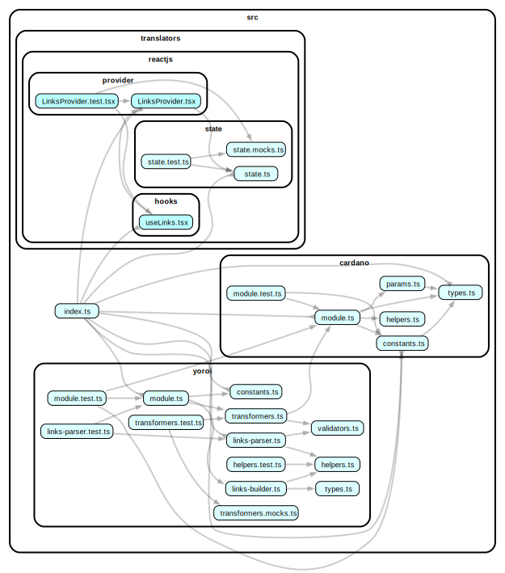

# @yoroi/links

[](https://www.npmjs.com/package/@yoroi/links)
[](https://opensource.org/licenses/Apache-2.0)
[](https://codecov.io/gh/Emurgo/yoroi)

## Overview

This package provides type-safe way to create and parse cryptocurrency-related links based on its URI definition (ABNF). It is designed to support different types of operations. It supports Cardano operations such as claims and legacy transfers within its blockchain ecosystem. It also allows to interpret and build crypto links.
**Important** to note that some links are handled by the app before the navigation.

## Features

- **Custom URI Scheme Handling**: Supports the 'web+cardano' URI scheme, tailored for Cardano blockchain interactions.
- **Type-Safe Link Creation and Parsing**: Utilizes TypeScript for ensuring the integrity and correctness of link structures.
- **Configurable for Different Operations/Chains**: Includes configurations for claim operations (`configCardanoClaimV1`) and legacy transfers (`configCardanoLegacyTransfer`), it can be extended.
- **Yoroi Deep Links**: Supports the 'yoroi' URI scheme, tailored for interation with Yoroi.

## Installation

How to install the package, e.g., via npm or yarn:

```bash
npm install @yoroi/links
# or
yarn add @yoroi/links
```

## Cardano usage

### Importing the module

```typescript
import {linksCardanoModuleMaker, configCardanoClaimV1} from '@yoroi/links'
```

### How to parse a link

```typescript
const {parse} = linksCardanoModuleMaker()

const parsedLink = parse(
  'web+cardano://claim/v1?code=123&faucet_url=http://example.com',
)
console.log(parsedLink)
```

### API reference

#### Interface

- `create`: Creates a crypto link based on the provided configuration and parameters.
- `parse`: Parses a given string into a Link object if supported, otherwise will throw.

#### Built-in configurations

- `configCardanoClaimV1`: Configuration for Cardano `claim` operations. [CIP99](https://github.com/cardano-foundation/CIPs/pull/546/files)
- `configCardanoLegacyTransfer`: Configuration for Cardano `legacy` transfers. [CIP13](https://cips.cardano.org/cips/cip13/)

#### Supported Schemes and Authorities

| Scheme        | Authority | Description                             |
| ------------- | --------- | --------------------------------------- |
| `web+cardano` | `claim`   | Used for proof of onboarding / airdrops |
| `web+cardano` | ``        | Used for legacy payment requests        |

## Yoroi Usage

> [!IMPORTANT] > **Important** Yoroi uses in query string arrays as name[index], e.g `whateverArray[0]=1&whateverArray[1]=`

### How to create a link

```typescript
const {create} = linksCardanoModuleMaker()
const {transfer} = linksYoroiModuleMaker('yoroi')

const cardanoLink = create({
  config: configCardanoLegacyTransfer,
  params: {
    amount: 1,
    address: '$stackchain',
  },
})

const yoroiPaymentRequestWithAdaLink = transfer.request.adaWithLink({
  link: cardanoLink.link,
  appId: 'app-id',
  authorization: 'uuid-v4',
  redirectTo: 'https://my.amazing.web/?amountRequested=1&session=03bf4dd213d',
})

console.log(yoroiPaymentRequestWithAdaLink)
```

### Supported schemes and authorities

| Scheme          | Authority          | Path       | Description                        |
| --------------- | ------------------ | ---------- | ---------------------------------- |
| `yoroi` `https` | `yoroi-wallet.com` | `transfer` | Used for requesting payments       |
| `yoroi` `https` | `yoroi-wallet.com` | `exchange` | Used for iteracting with exchanges |
| `yoroi` `https` | `yoroi-wallet.com` | `browser`  | User for launching dapps           |

## Testing the deep & universal links developing

```shell
# iOS
xcrun simctl openurl booted "https://yoroi-wallet.com/w1/transfer/request/ada?target[0]=%24stackchain"

# Android
adb shell am start -W -a android.intent.action.VIEW -d "yoroi://yoroi-wallet.com/w1/transfer/request/ada?amount=1&address=%24$stackchain"
```

## Types/Schema

Yoroi validates deeplinks and univeral links in a stricted way, missing params is fine, will warn users, adding extra params will make Yoroi to ignore your request completely.

### `PartnerInfoSchema`

This schema is designed for adding information about how Yoroi should behave, even though all are flagged as optional, it will change how Yoroi reacts to it, and for some funnels it might block the user, or trigger some red alerts about dangerous actions. **`PartnerInfoParams` is part of all links**. It includes the following fields:

- `isSandbox`: A boolean indicating the environment, when `true` deeplinks only work on non-production builds.
- `isTestnet`: A boolean that restrics whether it should work only in `mainnet` wallets (default) or only in testnets wallets like `preprod`, `preview`, etc.
- `appId`: A string with a maximum length of 40 characters that identifies that app. To create one open a PR on the clients that you wan't to interact. It will be bound in the aggreement.
- `redirectTo`: Yoroi may present a link button or automatic redirect the user based on some funnels, it requires `https`.
- `authorization`: All actions initiated within Yoroi will provide an authorization, that works along with the wallet used, by not passing it back, Yoroi can't continue from where it was left.
- `message`: Yoroi may present this message for some actions, be descriptive and concise around the action needed from Yoroi, otherwise users might reject your request.
- `walletId`: As the authorization, when provided, is expected back. Otherwise just set `isProduction` so Yoroi will know how to ask users to open any wallet with real funds.
- `signature`: Partner signature, it changes many behaviours inside Yoroi, specially regarding some warnings and dangerous messages. When providing your `appId` in the PR is expected a signed message that will be verified against your private key.

### `ExchangeShowCreateResultSchema`

This schema validates data for the creation result of a order to exchange coins, the link includes the following fields:

- `coinAmount`: The amount in the coin main denomination ie. Cardano ADA.
- `coin`: The coin ticker, Cardano ADA.
- `fiatAmount`: The amount of fiat currency.
- `fiat`: The fiat ticker, ie. USD.
- `status`: 'success' | 'failed' | 'pending' Indicates to Yoroi the message to display, if you need to include an explanation use the `message` param.
- `orderType`: 'buy' | 'sell' The order type.
- `provider`: Legacy, it should be replaced by `PartnerInfoParams.appId`

### `TransferRequestAdaSchema`

This schema is for validating transfer requests of ADA and includes the following fields:

- `targets`: An array of objects (with a minimum of 1 and maximum of 5 elements) where each object contains:
  - `receiver`: A string with a maximum length of 256 characters, it can be a wallet address or any domain name for your wallet address.
  - `datum` (optional) A CBOR string with a maximum length of 1024 characters.
  - `amounts`: An array of objects (with a minimum of 1 and maximum of 10 elements) where each object contains:
    - `tokenId`: A string with a maximum length of 256 characters, represented by `policyId` and `assetName` in hex, separated by a `.`, for ADA both are valid `.` or `` empty string.
    - `quantity`: A string with a maximum length of 80 characters, atomic, Cardano Lovelaces.
- `memo` (optional): A string with a maximum length of 256 characters, stored in the wallet local storage wallet, it is not included in the transaction.

### `TransferRequestAdaWithLinkSchema`

This schema validates transfer requests that include a URL and has the following fields:

- `link`: A URL string with a maximum length of 2048 characters, it supports the CIP13 for Cardano legacy transfer, that can also be created by this module.

### `BrowserLaunchDappUrlSchema`

This schema validates transfer requests that include a URL and has the following fields:

- `dappUrl`: A URL string with a maximum length of 2048 characters, this URL will be used internally to launch the dApp, if as a dApp developer the dApp is willing to capture the referer, remember to add e.g `&ref=yoroiwallet.com` to the `dappUrl` before building it throught the packages, otherwise it will launch with just the link provided.

This schema validates transfer requests that include a URL and has the following fields:

## How to make my dapp launch within Yoroi

### Quick implementation (JS/TS)

1. Install `@yoroi/links` package in your app
2. Import it `@yoroi/links` in your code
3. Use the factory to create the link
4. Lanch the link based on the platform that you are using
5. The platform should open Yoroi if it is installed

#### Snippet

```typescript
import {linksYoroiModuleMaker} from '@yoroi/links'

const {browser} = linksYoroiModuleMaker('yoroi')
const yoroiMobileLink = browser.launch.dappUrl({
  dappUrl: 'https://my-awesome-dapp.com?ref=yoroimobile.com',
  // if you have
  appId: 'app-id',
  // if initated by Yoroi please add it back
  authorization: 'uuid-v4',
  // some funnels can redirect the user automaticaly
  redirectTo: 'https://my-awesome-dapp.com?continueOn=my-funnel&data=123',
})

// whatever Links.openUrl(yoroiMobileLink)
console.log(yoroiMobileLink)
```

### Trusted dapp

Coming soon.

## For more

- [BIP-21](https://github.com/bitcoin/bips/blob/master/bip-0021.mediawiki)
- [EIP-681](https://eips.ethereum.org/EIPS/eip-681)
- [URI](https://www.google.com/url?sa=t&rct=j&q=&esrc=s&source=web&cd=&cad=rja&uact=8&ved=2ahUKEwiGtpWV-eOCAxVSmokEHdBOAn0QFnoECBQQAQ&url=https%3A%2F%2Fen.wikipedia.org%2Fwiki%2FUniform_Resource_Identifier&usg=AOvVaw2i8uSyn7gtMV9bW4Nmh4dK&opi=89978449)
- [ABNF](https://www.google.com/url?sa=t&rct=j&q=&esrc=s&source=web&cd=&cad=rja&uact=8&ved=2ahUKEwjYq-3u-OOCAxVxvokEHTx1CqsQFnoECBIQAQ&url=https%3A%2F%2Fen.wikipedia.org%2Fwiki%2FAugmented_Backus%25E2%2580%2593Naur_form&usg=AOvVaw3GEFuH6Hby-NUw6cxQpQUz&opi=89978449)
- [RFC-2234](https://datatracker.ietf.org/doc/html/rfc2234)

## Contributing

We welcome contributions from the community! If you find a bug or have a feature request, please open an issue or submit a pull request.

## 📚 Documentation

For detailed documentation, please visit our [documentation site](https://github.com/Emurgo/yoroi/wiki).

## 🧪 Testing

```bash
# Run tests
npm test

# Run tests in watch mode
npm run test:watch
```

## 🏗️ Development

```bash
# Install dependencies
npm install

# Build the package
npm run build

# Build for development
npm run build:dev

# Build for release
npm run build:release
```

## 📊 Code Coverage

The package maintains a minimum code coverage threshold of 20% with a 1% threshold for status checks.

[](https://codecov.io/gh/Emurgo/yoroi)

## 📈 Dependency Graph

Below is a visualization of the package's internal dependencies:



## 🤝 Contributing

We welcome contributions! Please see our [Contributing Guide](https://github.com/Emurgo/yoroi/blob/develop/CONTRIBUTING.md) for more details.

## 📄 License

This project is licensed under the Apache License 2.0 - see the [LICENSE](https://github.com/Emurgo/yoroi/blob/develop/LICENSE) file for details.

## 🔗 Links

- [GitHub Repository](https://github.com/Emurgo/yoroi/tree/develop/packages/links)
- [Issue Tracker](https://github.com/Emurgo/yoroi/issues)
