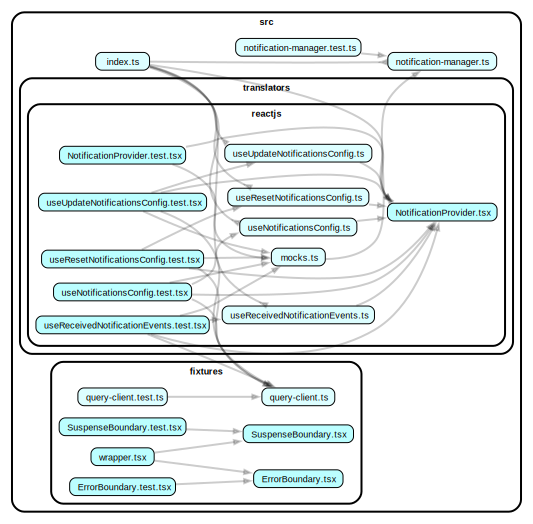

# `@yoroi/notifications`

[](https://www.npmjs.com/package/@yoroi/notifications)
[](https://opensource.org/licenses/Apache-2.0)
[](https://codecov.io/gh/Emurgo/yoroi)

The `@yoroi/notifications` package is responsible for handling local and push notifications in the Yoroi wallet. It enables applications to track important events, such as reward changes, new transactions, or marketing notifications.

This package is **platform-agnostic** and does **not depend on any environment-specific APIs**, making it usable in both **web** and **mobile** contexts.

---

## Features

- **Typed Notification Events:** Strongly typed notification events via `@yoroi/types`.
- **Local And Push Notification Handling:** Support for storing and handling notifications.
- **Event Persistence:** Notifications are stored and can be retrieved later.
- **Unread Tracking:** Tracks unread and read notification status.
- **Reactive Streams:** Exposes `RxJS` observables to subscribe to new notifications.
- **Configurable:** Supports per-trigger notification preferences.

---

## Development

All logic is covered by unit tests. Tests **must pass before merging** changes.

To run the tests:

```bash
yarn workspace @yoroi/notifications test
```

## Usage

### 1. Create a Subject for your notification trigger

Each event type uses a Subject to emit notifications:

```ts
const transactionReceivedSubject = new Subject<NotificationTypes.TransactionReceivedEvent>()
```

### 2. Create a notificationManager instance

```ts
export const notificationManager = notificationManagerMaker({
  eventsStorage: appStorage.join('events/'),
  configStorage: appStorage.join('settings/'),
  subscriptions: {
    [Notifications.Trigger.TransactionReceived]: transactionReceivedSubject,
  },
})


```

### 3. Hydrate the manager

This sets up internal subscriptions and prepares the manager for use:

```ts
notificationManager.hydrate()
```

### 4. Cleanup when needed

Ensure subscriptions are disposed of properly:

```ts
notificationManager.destroy()

```

## Architecture Overview

### NotificationManager

The notificationManager coordinates:

- Event subscriptions
- Notification persistence
- Unread counters
- User configuration

### It exposes

- hydrate(): Initializes subscriptions

- destroy(): Cleans up resources

- events: Methods to read, write, mark, and clear notifications

- config: Methods to read, update, and reset config

- newEvents$: Stream emitting new unread events

### Event Groups

Each notification is grouped (e.g. portfolio, transaction-history) for UI organization and filtering. Groups are determined by the notification trigger.

## Example with React

### 1. Setup the Provider

```tsx
import {NotificationProvider} from './NotificationProvider'

<NotificationProvider manager={notificationManager}>
  <App />
</NotificationProvider>
```

### 2. Consume the Manager

```tsx
const manager = useNotificationManager()

React.useEffect(() => {
  const sub = manager.newEvents$.subscribe((event) => {
    console.log('New notification:', event)
  })
  return () => sub.unsubscribe()
}, [manager])

```

## Adding a New Notification Type

To introduce a new type of notification:

1. Define it in `@yoroi/types`
   - Extend the `NotificationTrigger` enum
   - Create a new event type that extends `NotificationEventBase`
   - Update `NotificationManagerMakerProps` to include your new event type

2. Update `@yoroi/notifications`
   - Add default configuration to `defaultConfig` in `notification-manager.ts`
   - Update `notificationTriggerGroups` to assign a group for your trigger
   - Add the subject to the subscriptions when initializing the manager

## Notification Types

| Type         | Source        | Description                                 |
|--------------|---------------|---------------------------------------------|
| Local        | App-generated | Transaction received, rewards updated, etc. |
| Push         | Server-sent   | Marketing                                   |

## Contributing

We welcome contributions from the community! If you find a bug or have a feature request, please open an issue or submit a pull request.

## 📚 Documentation

For detailed documentation, please visit our [documentation site](https://github.com/Emurgo/yoroi/wiki).

## 🧪 Testing

```bash
# Run tests
npm test

# Run tests in watch mode
npm run test:watch
```

## 🏗️ Development

```bash
# Install dependencies
npm install

# Build the package
npm run build

# Build for development
npm run build:dev

# Build for release
npm run build:release
```

## 📊 Code Coverage

The package maintains a minimum code coverage threshold of 20% with a 1% threshold for status checks.

[](https://codecov.io/gh/Emurgo/yoroi)

## 📈 Dependency Graph

Below is a visualization of the package's internal dependencies:



## 🤝 Contributing

We welcome contributions! Please see our [Contributing Guide](https://github.com/Emurgo/yoroi/blob/develop/CONTRIBUTING.md) for more details.

## 📄 License

This project is licensed under the Apache License 2.0 - see the [LICENSE](https://github.com/Emurgo/yoroi/blob/develop/LICENSE) file for details.

## 🔗 Links

- [GitHub Repository](https://github.com/Emurgo/yoroi/tree/develop/packages/notifications)
- [Issue Tracker](https://github.com/Emurgo/yoroi/issues)
