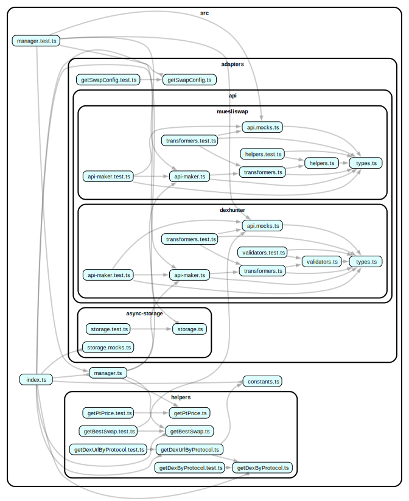

# @yoroi/swap

[](https://www.npmjs.com/package/@yoroi/swap)
[](https://opensource.org/licenses/Apache-2.0)
[

## Overview

The `@yoroi/swap` package enhances the Yoroi wallet by enabling integrated cryptocurrency swapping capabilities, thereby enriching the user experience and expanding the wallet's functionality.

## Glossary

In the context of the `@yoroi/swap` package, it's crucial to establish clear definitions for terms like **DEX**, **Protocol**, **Aggregator**, and **Liquidity Pool** to ensure consistent understanding among developers and users. These terms are often used interchangeably across various platforms, leading to confusion. A well-defined glossary helps maintain clarity and consistency in documentation and communication.

- **DEX (Decentralized Exchange)**: A decentralized platform that enables users to trade cryptocurrencies directly with each other without the need for a central authority. DEXs operate through smart contracts on blockchain networks, allowing for peer-to-peer transactions and increased security.
- **Protocol**: In decentralized finance (DeFi), a protocol refers to a set of rules and standards that define how transactions and interactions occur within a blockchain network. Protocols govern the behavior of DEXs, ensuring consistency, security, and interoperability among various DeFi applications.
- **Aggregator**: A service that consolidates liquidity from multiple DEXs and market makers to provide users with the best possible pricing for their trades. Aggregators analyze various platforms to find optimal trading routes, often splitting orders across multiple DEXs to minimize slippage and achieve favorable rates.
- **Liquidity Pool**: A collection of cryptocurrency tokens or assets locked in a smart contract. These pools are the foundation for decentralized trading, lending, and other financial services, eliminating the need for traditional intermediaries. In DeFi, liquidity pools enable 24/7 trading, automated price discovery, and opportunities for passive income through liquidity provision.

**Examples:**

- **Aggregators:**

  - [DexHunter](https://dexhunter.io/)
  - [MuesliSwap](https://muesliswap.com/)

- **DEXes:**

  - [MuesliSwap](https://muesliswap.com/)
  - [Minswap](https://minswap.org/)
  - [WingRiders](https://wingriders.com/)
  - [Spectrum](https://spectrum.fi)
  - [Sundaeswap](https://sundae.fi)
  - [Teddy](http://app.teddyswap.org)
  - [Vyfi](https://app.vyfi.io)

- **Protocols:**:
  - `WingRiders_v1`
  - `WingRiders_v2`
  - `Muesliswap_v1`

By standardizing these definitions, we can reduce misunderstandings and ensure that all stakeholders have a unified understanding of these critical components within the `@yoroi/swap` package. Consistent terminology enhances communication, facilitates collaboration, and improves the overall quality of the software documentation.

### Multi-Role Organizations

It's also important to highlight that some organizations can play more than one role at the same time.

For example, **MuesliSwap** is not only a **DEX**, but it also has its own **protocols** (such as its **order book model** and **AMM model**) and operates as an **aggregator**, routing trades across different liquidity sources for better pricing.

Understanding these overlapping roles helps in distinguishing **where liquidity is sourced from**, **who is facilitating trades**, and **which protocols define the execution rules**.

## Usage

The `@yoroi/swap` package provides a comprehensive interface for cryptocurrency swapping operations. Here are examples of how to use the package:

### Basic Setup

```typescript
import { swapManagerMaker, swapStorageMaker } from '@yoroi/swap'
import { Swap } from '@yoroi/types'

// Initialize storage
const storage = swapStorageMaker()

// Create swap manager
const swapManager = swapManagerMaker({
  address: 'addr1qxck...', // Cardano address
  addressHex: 'addr1qxck...', // Hex format address
  network: 'mainnet', // or 'testnet'
  primaryTokenInfo: {
    id: 'policyId.assetName',
    decimals: 6,
    // ... other token info
  },
  isPrimaryToken: (tokenId) => tokenId === 'ADA',
  stakingKey: 'stake1uxck...', // Optional staking key
  storage,
  partners: {
    // Optional partner configurations
    [Swap.Aggregator.Dexhunter]: {
      apiKey: 'your-dexhunter-api-key',
    },
    [Swap.Aggregator.Muesliswap]: {
      apiKey: 'your-muesliswap-api-key',
    },
  },
})
```

### Token Operations

```typescript
// Get available tokens from all supported DEXs
const tokensResponse = await swapManager.api.tokens()
if (tokensResponse.tag === 'right') {
  const tokens = tokensResponse.value.data
  console.log('Available tokens:', tokens)
} else {
  console.error('Failed to fetch tokens:', tokensResponse.error)
}

// Get token price
import { getPtPrice } from '@yoroi/swap'
const tokenPrice = await getPtPrice(tokenInfo, dexhunterApi)
```

### Swap Operations

```typescript
// Get swap estimate
const estimateRequest: Swap.EstimateRequest = {
  tokenIn: {
    id: '.',
    amount: '1000000', // 1 ADA in lovelace
  },
  tokenOut: {
    id: 'policyId.assetName',
    amount: '0', // Will be calculated
  },
  slippage: 1, // 1% slippage tolerance
  routingPreference: 'auto', // or specific aggregators
}

const estimateResponse = await swapManager.api.estimate(estimateRequest)
if (estimateResponse.tag === 'right') {
  const estimate = estimateResponse.value.data
  console.log('Swap estimate:', {
    inputAmount: estimate.inputAmount,
    outputAmount: estimate.outputAmount,
    fee: estimate.fee,
    priceImpact: estimate.priceImpact,
    protocol: estimate.protocol,
  })
}

// Create a swap order
const createRequest: Swap.CreateRequest = {
  tokenIn: {
    id: '.',
    amount: '1000000',
  },
  tokenOut: {
    id: 'policyId.assetName',
    amount: '50000000', // Expected output
  },
  slippage: 1,
  protocol: Swap.Protocol.Minswap_v2,
  walletAddress: 'addr1qxck...',
}

const createResponse = await swapManager.api.create(createRequest)
if (createResponse.tag === 'right') {
  const order = createResponse.value.data
  console.log('Swap order created:', {
    orderId: order.orderId,
    txHash: order.txHash,
    status: order.status,
  })
}

// Get limit order options
const limitOptionsRequest: Swap.LimitOptionsRequest = {
  tokenIn: { id: '.', amount: '1000000' },
  tokenOut: { id: 'policyId.assetName', amount: '0' },
  price: 0.05, // Target price
}

const limitOptionsResponse = await swapManager.api.limitOptions(limitOptionsRequest)
if (limitOptionsResponse.tag === 'right') {
  const options = limitOptionsResponse.value.data.options
  console.log('Limit order options:', options)
}
```

### Order Management

```typescript
// Get user's orders
const ordersResponse = await swapManager.api.orders()
if (ordersResponse.tag === 'right') {
  const orders = ordersResponse.value.data
  console.log('User orders:', orders.map(order => ({
    orderId: order.orderId,
    status: order.status,
    inputToken: order.inputToken,
    outputToken: order.outputToken,
    placedAt: order.placedAt,
  })))
}

// Cancel an order
const cancelRequest: Swap.CancelRequest = {
  orderId: 'order-123',
  protocol: Swap.Protocol.Minswap_v2,
}

const cancelResponse = await swapManager.api.cancel(cancelRequest)
if (cancelResponse.tag === 'right') {
  console.log('Order cancelled successfully')
} else {
  console.error('Failed to cancel order:', cancelResponse.error)
}
```

### Settings Management

```typescript
// Update swap settings
const newSettings = swapManager.assignSettings({
  slippage: 2, // 2% slippage tolerance
  routingPreference: [Swap.Aggregator.Muesliswap], // Use only MuesliSwap
})

console.log('Updated settings:', newSettings)

// Get current settings
console.log('Current settings:', swapManager.settings)

// Clear storage
await swapManager.clearStorage()
```

### Utility Functions

```typescript
import { 
  getDexByProtocol, 
  getDexUrlByProtocol, 
  getBestSwap,
  dexUrls 
} from '@yoroi/swap'

// Get DEX information for a protocol
const dex = getDexByProtocol(Swap.Protocol.Minswap_v2)
console.log('DEX for Minswap v2:', dex) // Output: Swap.Dex.Minswap

// Get DEX URL for a protocol
const dexUrl = getDexUrlByProtocol(Swap.Protocol.Minswap_v2)
console.log('DEX URL:', dexUrl) // Output: "https://minswap.org"

// Get all available DEX URLs
console.log('All DEX URLs:', dexUrls)

// Compare swap options to find the best one
const bestSwap = getBestSwap(tokenOutPrice)
const optimalSwap = [swapOption1, swapOption2, swapOption3].reduce(bestSwap)
console.log('Best swap option:', optimalSwap)
```

### Error Handling

```typescript
// Handle API responses
const response = await swapManager.api.tokens()
if (response.tag === 'left') {
  // Handle error
  switch (response.error.status) {
    case 400:
      console.error('Bad request:', response.error.message)
      break
    case 401:
      console.error('Unauthorized - check API keys')
      break
    case 500:
      console.error('Server error:', response.error.message)
      break
    default:
      console.error('Unknown error:', response.error)
  }
} else {
  // Handle success
  console.log('Success:', response.value.data)
}
```

### Advanced Configuration

```typescript
// Configure routing preferences
const advancedSettings = swapManager.assignSettings({
  routingPreference: [
    Swap.Aggregator.Dexhunter,
    Swap.Aggregator.Muesliswap
  ],
  slippage: 0.5, // 0.5% slippage for better rates
})

// Use specific protocols for better control
const protocolSpecificEstimate = await swapManager.api.estimate({
  ...estimateRequest,
  protocol: Swap.Protocol.Wingriders_v2, // Force specific protocol
})
```

This package provides a complete solution for integrating cryptocurrency swapping functionality into your Cardano wallet application, with support for multiple DEXs, aggregators, and advanced features like limit orders and order management.

## Contributing

We welcome contributions from the community! If you find a bug or have a feature request, please open an issue or submit a pull request.

## 📚 Documentation

For detailed documentation, please visit our [documentation site](https://github.com/Emurgo/yoroi/wiki).

## 🧪 Testing

```bash
# Run tests
npm test

# Run tests in watch mode
npm run test:watch
```

## 🏗️ Development

```bash
# Install dependencies
npm install

# Build the package
npm run build

# Build for development
npm run build:dev

# Build for release
npm run build:release
```

## 📊 Code Coverage

The package maintains a minimum code coverage threshold of 20% with a 1% threshold for status checks.

[](https://codecov.io/gh/Emurgo/yoroi)

## 📈 Dependency Graph

Below is a visualization of the package's internal dependencies:



## 🤝 Contributing

We welcome contributions! Please see our [Contributing Guide](https://github.com/Emurgo/yoroi/blob/develop/CONTRIBUTING.md) for more details.

## 📄 License

This project is licensed under the Apache License 2.0 - see the [LICENSE](https://github.com/Emurgo/yoroi/blob/develop/LICENSE) file for details.

## 🔗 Links

- [GitHub Repository](https://github.com/Emurgo/yoroi/tree/develop/packages/swap)
- [Issue Tracker](https://github.com/Emurgo/yoroi/issues)
