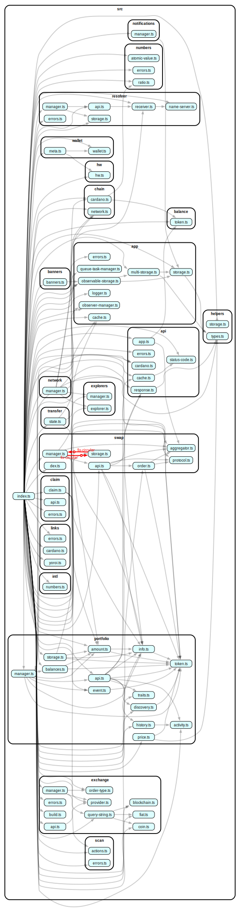

# @yoroi/types

[](https://www.npmjs.com/package/@yoroi/types)
[](https://opensource.org/licenses/Apache-2.0)
[](https://codecov.io/gh/Emurgo/yoroi)

The Types package of Yoroi SDK - A collection of TypeScript type definitions and interfaces used across the Yoroi ecosystem.

## 📦 Installation

```bash
npm install @yoroi/types
# or
yarn add @yoroi/types
```

## 🔧 Requirements

- Node.js >= 22.12.0
- TypeScript >= 5.3.3
- Peer Dependencies:
  - @emurgo/yoroi-lib >= 2.0.0
  - axios >= 1.9.0
  - bignumber.js >= 9.3.0
  - rxjs >= 7.8.2

## 🚀 Usage

```typescript
import { /* your imports */ } from '@yoroi/types';
```

## 📚 Documentation

For detailed documentation, please visit our [documentation site](https://github.com/Emurgo/yoroi/wiki).

## 🧪 Testing

```bash
# Run tests
npm test

# Run tests in watch mode
npm run test:watch
```

## 🏗️ Development

```bash
# Install dependencies
npm install

# Build the package
npm run build

# Build for development
npm run build:dev

# Build for release
npm run build:release
```

## 📊 Code Coverage

The package maintains a minimum code coverage threshold of 20% with a 1% threshold for status checks.

[](https://codecov.io/gh/Emurgo/yoroi)

## 📈 Dependency Graph

Below is a visualization of the package's internal dependencies:



## 🤝 Contributing

We welcome contributions! Please see our [Contributing Guide](https://github.com/Emurgo/yoroi/blob/develop/CONTRIBUTING.md) for more details.

## 📄 License

This project is licensed under the Apache License 2.0 - see the [LICENSE](https://github.com/Emurgo/yoroi/blob/develop/LICENSE) file for details.

## 🔗 Links

- [GitHub Repository](https://github.com/Emurgo/yoroi/tree/develop/packages/types)
- [Issue Tracker](https://github.com/Emurgo/yoroi/issues) 